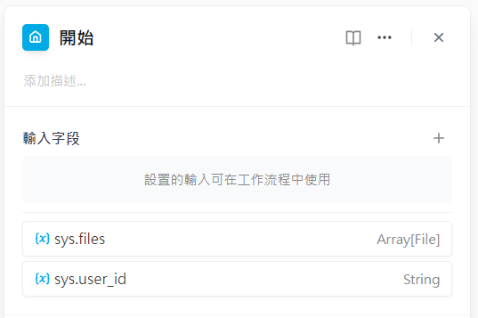
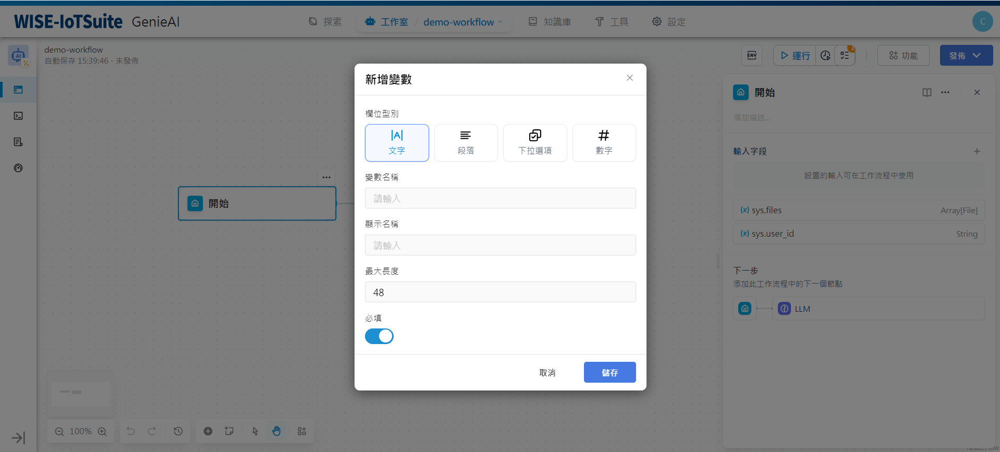
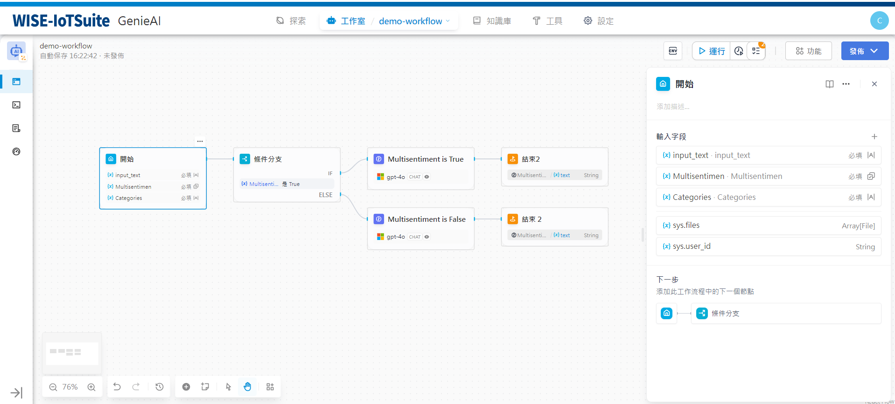

# 開始
### 定義
為啟動工作流程設定初始參數。
在開始節點中，您可以自訂啟動工作流程的輸入變數。每個工作流程都需要一個開始節點。

開始節點支援定義四種類型輸入變數：
- 文字
- 段落
- 下拉選項
- 數位
- 文件（即將推出）


配置完成後，工作流程會在執行時提供開始節點中定義的變數值。


Tip: 在Chatflow中，開始節點提供了內建系統變數：```sys.query```和```sys.files```。
```sys.query```用於對話應用中的使用者輸入問題。
```sys.files```用於對話中的文件上傳，如上傳圖片，這需要與圖片理解模型一起使用。