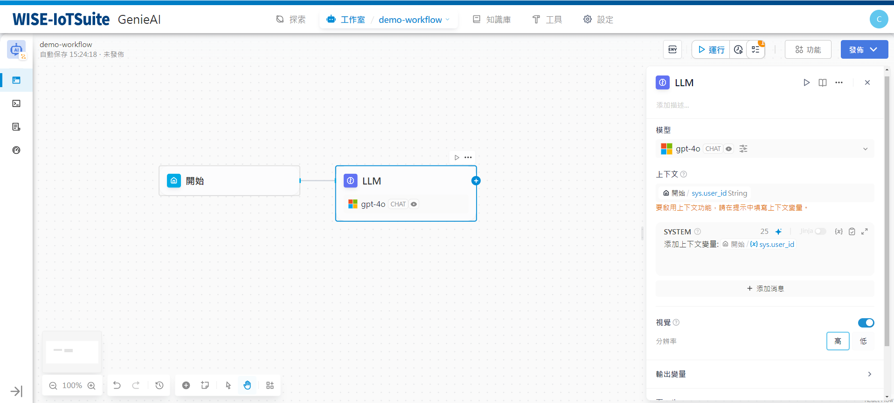
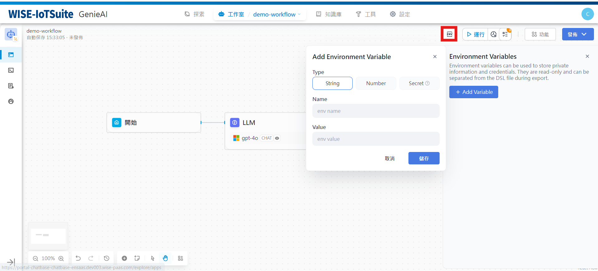
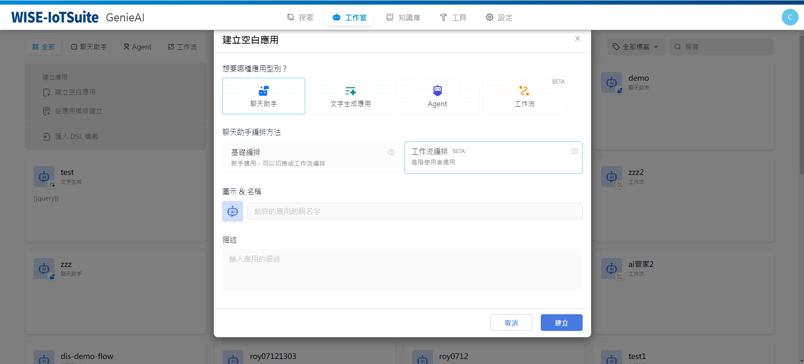
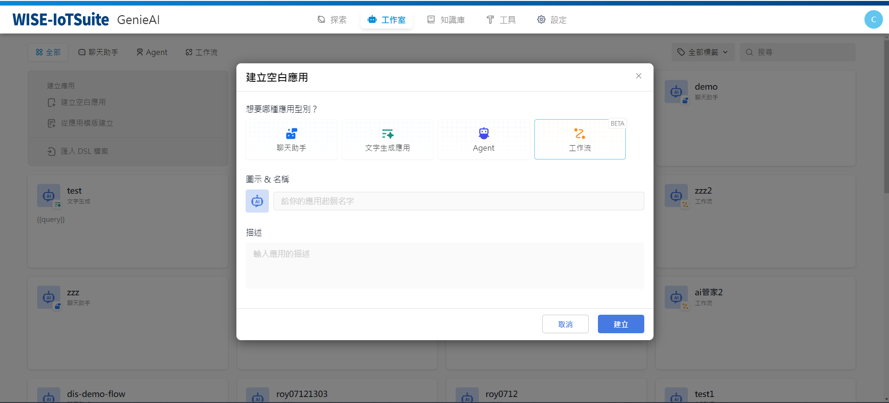

# 關鍵概念
### 節點
**節點**是工作流程的關鍵組成，透過連接不同功能的節點，執行工作流程的一系列操作。
工作流程的核心節點請查看節點說明。
### 變數
**變數用於串聯工作流程內前後節點的輸入與輸出**，實現流程中的複雜處理邏輯。

- 工作流程需要定義啟動執行變量，如聊天機器人需要定義一個輸入變數```sys.query```; 
- 節點一般需定義輸入變量，如定義問題分類器的輸入變數為```sys.query```; 
- 引用變數時只可引用流程上游節點的變數；
- 為避免變數名稱重複，節點命名不可重複；
- 節點的輸出變數一般為系統固定變量，不可編輯。

### 環境變數
**環境變數用於保護工作流程內所涉及的敏感資訊**，例如執行工作流程時所涉及的API 金鑰、資料庫密碼等。它們被儲存在工作流程中，而不是程式碼中，以便在不同環境中共用。

支援以下三種資料類型:
- String 字串
- Number 數字
- Secret 金鑰

環境變數擁有以下特性：
- 環境變數可在大部分節點內全域引用；
- 環境變數命名不可重複；
- 節點的輸出變數一般為唯讀變量，不可寫入；

### Chatflow 和Workflow
**應用場景**
- **Chatflow**：面向對話類情景，包括客戶服務、語義搜尋、以及其他需要在建立回應時進行多步驟邏輯的對話式應用程式。
- **Workflow**：面向自動化和批次情景，適合高品質翻譯、資料分析、內容產生、電子郵件自動化等應用程式。

**使用入口**



**可用節點差異**
1. End 節點屬於Workflow 的結束節點，僅可在流程結束時選擇。
2. Answer 節點屬於Chatflow ，用於串流輸出文字內容，並支援在流程中間步驟輸出。
3. Chatflow 內建聊天記憶（Memory），用於儲存和傳遞多輪對話的歷史訊息，可在LLM 、問題分類等節點內開啟，Workflow 無Memory 相關配置，無法開啟。
4. Chatflow 的開始節點內建變數包括：```sys.query```，```sys.files```，```sys.conversation_id```，```sys.user_id```。 Workflow 的開始節點內建變數包括：```sys.files```，```sys.user_id```