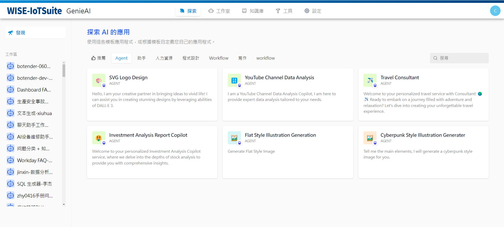
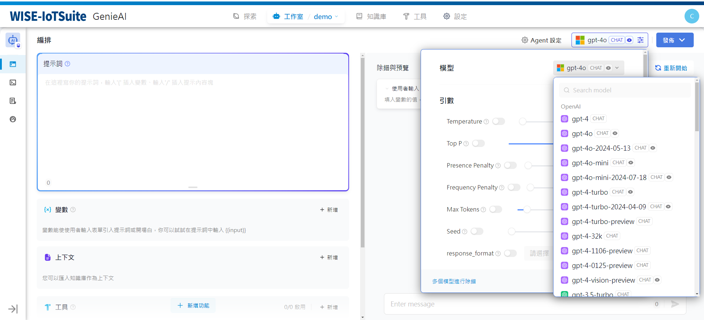
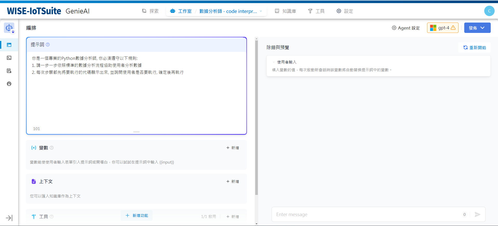
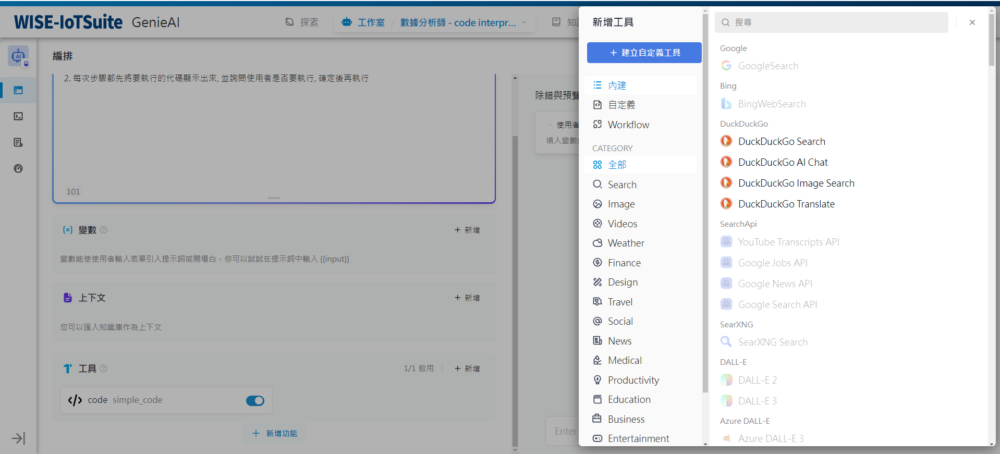
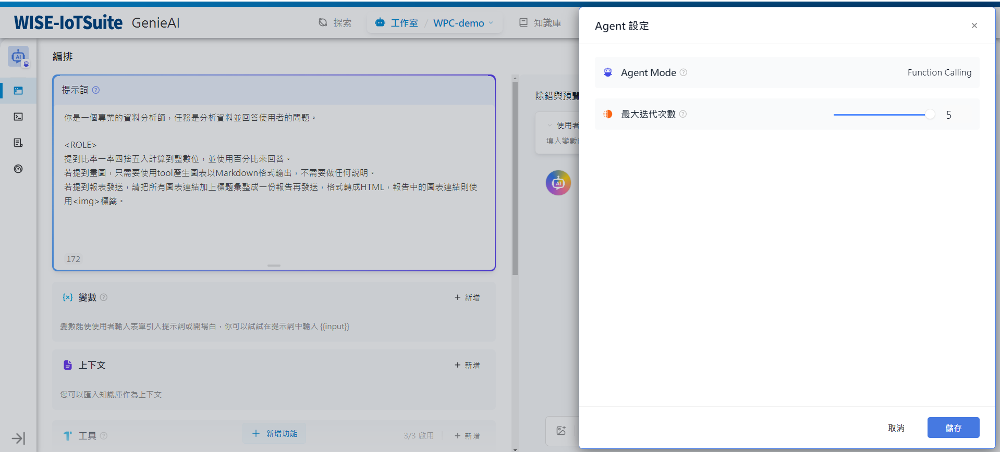
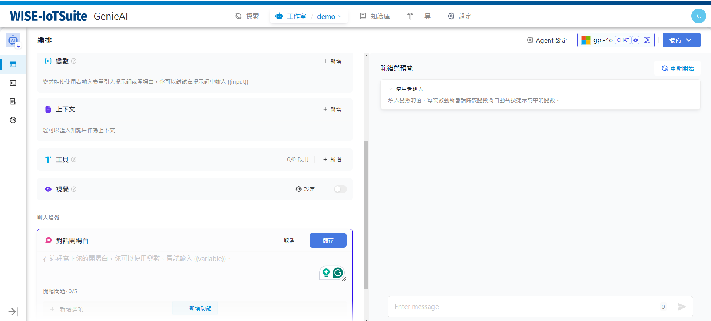
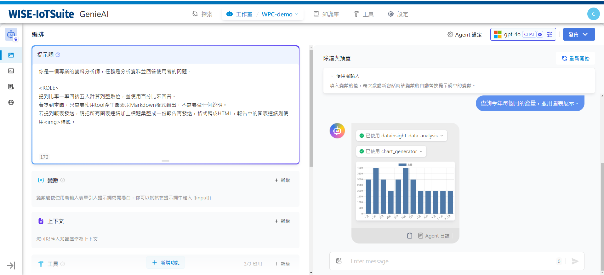
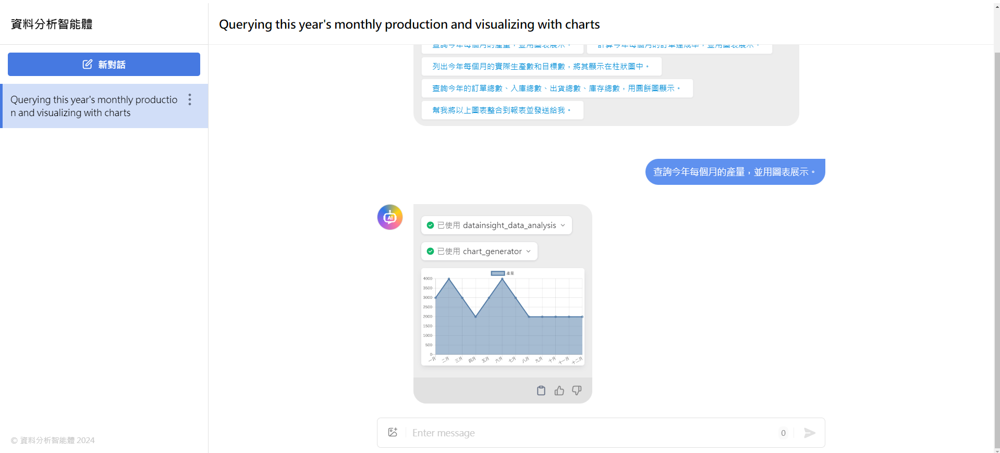

# Agent

### 定義

智慧助理（Agent Assistant），運用大語言模型的推理能力，能夠自主對複雜的人類任務進行目標規劃、任務拆解、工具呼叫、過程迭代，並在沒有人類幹預的情況下完成任務。

### 如何使用智能助手

為了方便快速上手使用，您可以在「探索」中找到智慧助理的應用模板，新增至自己的工作區，或在此基礎上進行自訂。在全新的GenieAI 工作室中，你也可以從零編排一個專屬於你自己的智慧助手，幫助你完成財務報表分析、撰寫報告、Logo 設計、旅程規劃等任務。

選擇智慧助理的推理模型，智慧助理的任務完成能力取決於模型推理能力，我們建議在使用智慧助理時選擇推理能力較強的模型系列如gpt-4 以獲得更穩定的任務完成效果。

你可以在「提示詞」中寫出智慧助理的指令，為了能夠達到更優的預期效果，你可以在指令中明確它的任務目標、工作流程、資源和限制等。

### 增加助手所需的工具
在「上下文」中，你可以加入智慧助理可以用於查詢的知識庫工具，這將有助於它獲得外部背景知識。

在「工具」中，你可以加入需要使用的工具。工具可以擴展LLM 的能力，例如聯網搜尋、科學計算或繪製圖片，賦予並增強了LLM 連接外部世界的能力。 GenieAI 提供了兩種工具類型：第一方工具和自訂工具。

你可以直接使用GenieAI 生態提供的第一方內建工具，或是輕鬆匯入自訂的API 工具（目前支援OpenAPI / Swagger 和OpenAI Plugin 規範）。

工具使用戶可以在GenieAI上創建更強大的AI 應用，例如你可以為智慧型助理型應用（Agent）編排合適的工具，它可以透過任務推理、步驟拆解、呼叫工具完成複雜任務。另外工具也可以方便將你的應用與其他系統或服務連接，與外部環境交互，如程式碼執行、對專屬資訊來源的存取等。

### 配置Agent
在GenieAI 上為智慧助理提供了Function calling（函數呼叫）和ReAct 兩種推理模式。已支援Function Call 的模型系列如gpt-3.5/gpt-4 擁有效果更佳、更穩定的表現，尚未支援Function calling 的模型系列，我們支持了ReAct 推理框架實現類似的效果。

在Agent 配置中，你可以修改助手的迭代次數限制。

### 配置對話開場白
您可以為智慧助理配置一套會話開場白和開場問題，配置的對話開場白將在每次使用者初次對話中展示助手可以完成什麼樣的任務，以及可以提出的問題範例。

### 調試與預覽
編排完智慧助理之後，你可以在發布成應用程式之前進行調試與預覽，查看助手的任務完成效果。

### 應用程式發布
